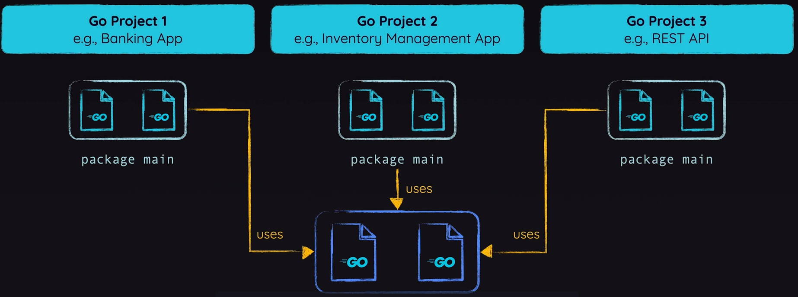

#  1. Basics of GO

```go
package main

import "fmt"

func main(){
    fmt.Print("Hello");
}
```
- To run this file : **`go run app.go`**
- If you try to run **`go build`**, it will throw error of **ModuleNotFound**


- Go is **statically typed** language. So, types are important to be mentioned > *Int | Float64* 
- All Go value types come with a so-called "null value" > *int = 0 | float64 = 0.0 | string = "" | bool = false*

- `var investmentAmount, years float64 = 1000, 10` > These single line declaration can have multple datatypes as well.

### (1.1) PACKAGES -
 
- `package main` is the **ENTRY point** of the execution for GO.
- Each go file is to be included inside a PACKAGE.
- GO can't have mulitple packages.
- Mulitple files can have the same package.

- Within same PACKAGES, you can import any file to other file without acutally using the IMPORT KEYWORD.
- If you're working with different packages in GO, the **FIRST LETTER MUST BE CAPITAL**

### (1.2) MODULES -
- Every GO package is under any single Module.
- `go init mod {module_path}` > module_path: example.com/go-path.

### (1.3) STRUCT -
- Used to bundle things and vars together.

# 2. Medium Concepts - (Pointers) 

### (2.1) Mutuation Methods
- When you are trying to **change some data of any struct** then normal argument passing will NOT work.
- You have to pass the **struct address** as argument, so that ORIGINAL value is changed.
- Or else for every NON-ADDRESS argument, a copy is made.

### (2.2) Creator or Constructor Function
- Special function which is just like a Pattern which is used while writing Golang Code.
- It is **UTILITY function** that takes care of **creating a STRUCT.**
- Syntactically, the name starts with `new` - Like `func newUser`
```go
func newUser(firstName, lastName, dateOfBirth string) user {
    return user{
        firstName:   firstName,
		lastName:    lastName,
		dateOfBirth: dateOfBirth,
		createdAt:   time.Now(),
	}
}
```

WITH POINTER - We can return a Pointer as well.
```go
func newUser(firstName, lastName, dateOfBirth string) *user {
    return &user{
        firstName:   firstName,
		lastName:    lastName,
		dateOfBirth: dateOfBirth,
		createdAt:   time.Now(),
	}
}
```

- You can add validation steps inside the **STRUCT FUNCTION** only and not repeat it every time!


### (2.3) Struct Embedding
- Putting one struct in another struct is known as `STRUCT EMBEDDING` > Similar to Inheritance Concept.


### (2.4) Embedding Interfaces
- It is basically mixture of 2 or more interfaces together to use it somewhere else.
- If there is only one SINGLE METHOD in the interface then the naming convention is little different.
- EG: The _method name_ is **Save()** > Then the _interface name_ is **saver OR Saver**


### (2.5) Find type of value
- If the variable is written inside the **SWITCH**, then > **switch value.(type)**
- If it is outside, then > **varType, isTrue := a.(int)**


### (2.6) Any type in Golang
- The "any" type can be configured with the help of the keyword > **interface{}**
- It accepts any type and can be usefull in some cases.
- But aviod using it often in the code blocks.


### (2.7) Generics Basic Need
- To secure the any type, we make use of Generics in out code.
- Syntactically, it can be something like:
	```
	func add[T string|int|float64] (a, b T) T {}
	```
- You can name `T` anything, but here I have named it as `T`.


# Advances DS in Golang

### (2.1) Arrays
- Collection of same data types together (list in Python).
- Syntax is as follows:
	```
	prices: [4]float64{23.4, 12.5, 95.2, 100.4}
	```

	or

	```
	var productNames [4]string = [4]string{"A Book"}
	```
